# EduGaza Architecture

This document explains the architectural concepts behind EduGaza.

## Microservices

We have used a microservice-based architecture for the following reasons:
- Optimized scalability
- On-prem / On-Cloud support
- Increased Reusability accross similar projects

It consists of following:
- 9 microserices for Web APIs
- Traefik as API Gateway
- 1 service for Backend For Frontend
- Redis for caching
- NATs for 

Here is the list of services:

| Service                 | Stack                           | Documentation           |
|-------------------------|---------------------------------|-------------------------|
|FE Service               | Next JS, PWA-Enabled            |                         |
|API gateway              | Traefik                         |                         |
|Auth Service             | Go - Redis -NATS - MongoDB      |                         |
|User Profile Service     | Go - Redis -NATS - MongoDB      |                         |
|Parental Control Service | Go - Redis -NATS - MongoDB      |                         |
|Stories Service          | Go - Redis -NATS - MongoDB      |                         |
|Learning OutCome Service | Go - Redis -NATS - MongoDB      |                         |
|Playback Service         | Go - Redis -NATS - MongoDB      |                         |
|Assessment Service       | Go - Redis -NATS - MongoDB      |                         |
|Report Service           | Go - Redis -NATS - MongoDB      |                         |
|Notification Service     | Go - Redis -NATS - MongoDB      |                         |

Here is the diagram that demonstrates the high-level architecture.

